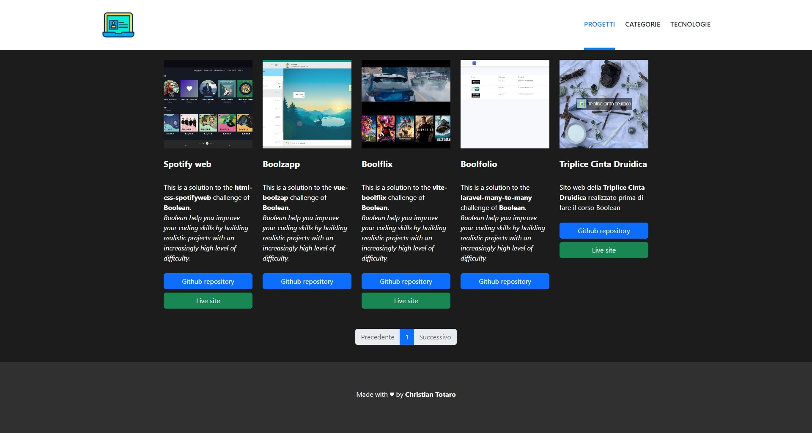

#vite-boolfolio


## Vue project

```bash
# 1. Crea repo su git (senza opzioni se non pubblico)
# 2. Clonare la repo e apri la cartella su vs code e aprire terminale
# 3. digitare: npm init vue@latest
# 4. per creare il progetto nella directory corrente mettere solo un  punto
# 5. nome package lo stesso della cartella poi lasciare tutto come sta
# 6. dire si all'opzione vue router
# 7. npm install
# 8. npm run dev

npm install bootstrap axios @fortawesome/fontawesome-free sass

# eventualmente facciamo vedere fontsource: https://fontsource.org/fonts/montserrat
npm install @fontsource/montserrat

# copiamo la cartella webfonts da fontawesome in node-modules in assets
# inizialmente commentiamo l'importazione e l'uso del router di view dal main js
```

### Assets
```bash
# src/assets/styles/partials/_variable.scss
// COLORS
$bg-color: #fefefe;
$text-color: #333;

//Typography
$main-font: 'Montserrat', sans-serif;

# src/assets/styles/main.scss
@use './partials/variables' as *;

$fa-font-path: '../webfonts';
@import '@fortawesome/fontawesome-free/scss/fontawesome.scss';
@import '@fortawesome/fontawesome-free/scss/solid.scss';

@import 'bootstrap/scss/bootstrap';

@import '@fontsource/montserrat/index.css';
@import '@fontsource/montserrat/700.css';

# ...style here
```


